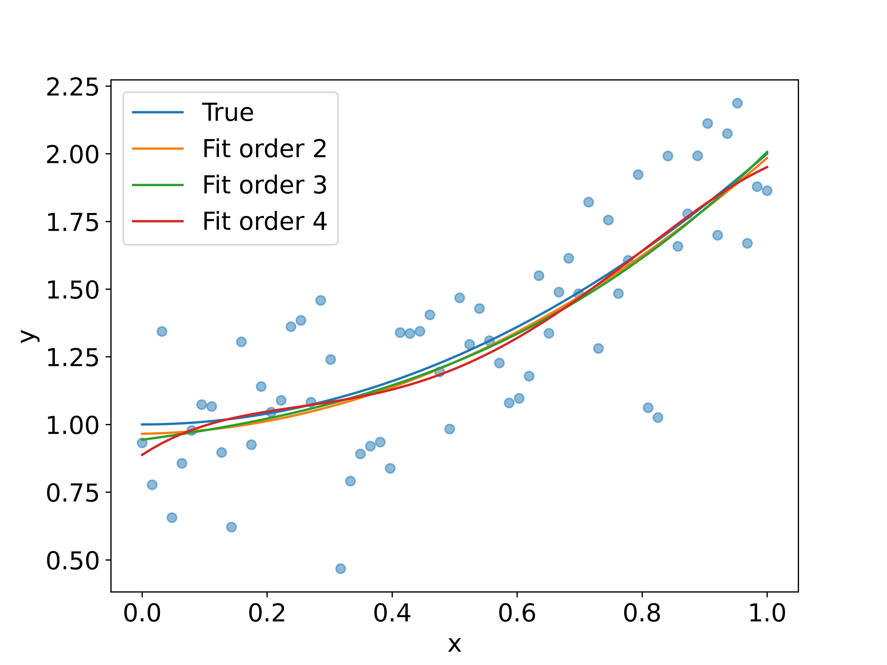

# Jiankai_Project2

## Get Started
This command line tool can be used to perform polynomial fitting experiments as well as polynomial overfitting experiments. A `.txt` file containing two columns of data can be provided or the fitting experiments can be performed by choosing to generate simulated random data.

## Steps

`cd [project folder]`

`bash init.sh`

The comand line tools has two mode to poly fit

`python3 poly_fit.py fit --filename data.txt 2 3 4`  to perform 2,3,4 order poly fit of the data from data.txt

The console will pop up message: `Method (0, 1) [0]:` and you can type `0` or `1`

`python3 poly_fit.py fit 2 3 4` to perform 2,3,4 order poly fit of the data generate random.

use `python3 poly_fit.py fit --help` to check help

## Result

The result will be a file named `result.png` in the project folder

